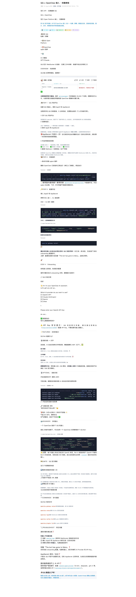

# QQ 接入 OpenClaw（官方 Open Platform 路线，精简版）

来源：
- https://mp.weixin.qq.com/s/FmsKPnTiHc_yPm73F62xIA

参考图：


## 1. 前置条件
- OpenClaw 已安装并可运行。
- 拥有 QQ 开放平台机器人账号。
- 拿到 `AppID` 与 `AppSecret`（`AppSecret` 只展示一次）。

## 2. QQ 平台创建机器人
- 登录 `q.qq.com`，创建机器人。
- 开启需要的消息权限（私聊/群聊/频道按需）。
- 保存 `AppID` 和 `AppSecret`。

## 3. OpenClaw 侧安装与配置
```bash
# 方式 A：本项目配置菜单（推荐）
bash ./config-menu.sh
# 消息渠道配置 -> 非官方渠道配置 -> QQ（社区插件）

# 方式 B：手动命令
openclaw plugins install @sliverp/qqbot@latest
openclaw channels add --channel qqbot
openclaw gateway restart
```

或直接配置键值：

```bash
openclaw config set channels.qqbot.enabled true
openclaw config set channels.qqbot.appId "你的AppID"
openclaw config set channels.qqbot.clientSecret "你的AppSecret"
```

## 4. 验证
- 私聊机器人发送测试消息。
- 群聊场景需 `@机器人` 才会触发回复（平台限制）。

## 5. 常见问题
- 回复 `The bot has gone to Mars`：说明 onboarding 未完成。
- 群里无回复：确认已 `@机器人`，并检查插件与网关状态。
- 国内网络慢：优先使用本项目本地打包插件。
- 主动消息受限：QQ 平台对主动推送频率有约束。
